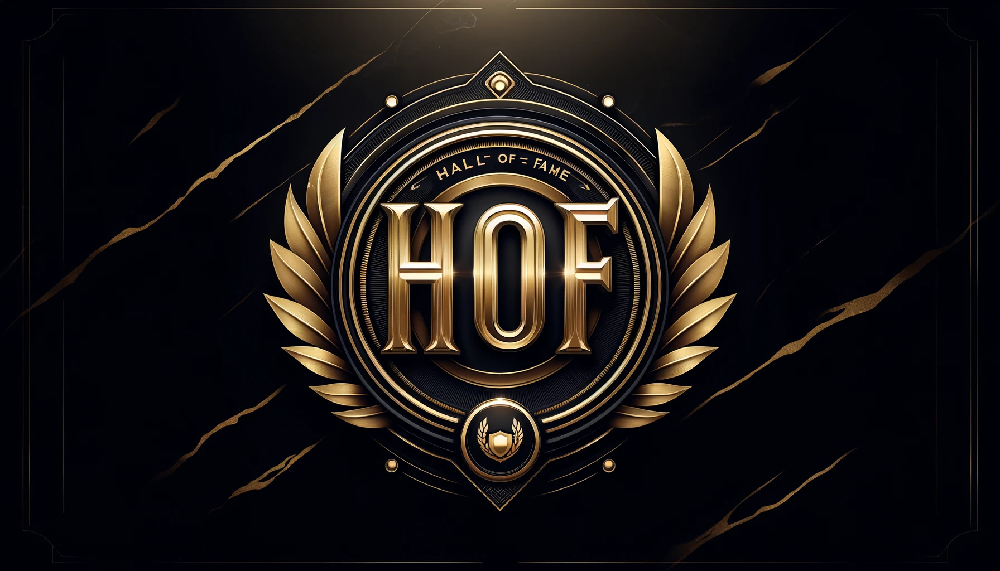

# Hall of Fame - Celebrate Your Discord Server's Best Moments



[](https://top.gg/bot/1177041673352663070)
[](https://github.com/LukasKristensen/discord-hall-of-fame-bot/actions/workflows/tests.yml)
[](https://www.python.org/)
[](https://discord.gg/r98WC5GHcn)

**Hall of Fame turns your server's best moments into a permanent highlight reel, and gives the credit
to the members who created them.** Any emoji your community actually reacts with can send a message to
the hall of fame, and the members who land there get leaderboards, profiles and a yearly wrapped for it.

It is a recognition bot, not an archive. The board is where the moments live; the leaderboards, member
profiles and Hall of Fame Wrapped are what make landing on it worth something.

[Add the bot to your server](https://discord.com/oauth2/authorize?client_id=1177041673352663070) ·
[Join the support server](https://discord.gg/r98WC5GHcn) ·
[Vote on top.gg](https://top.gg/bot/1177041673352663070/vote)

<br>


## Contents

- [What Hall of Fame does](#what-hall-of-fame-does)
- [How it differs from a starboard](#how-it-differs-from-a-starboard)
- [Quick start](#quick-start)
- [Commands](#commands)
- [Custom Emoji Whitelist](#custom-emoji-whitelist)
- [How reactions are counted](#how-reactions-are-counted)
- [Recognition: leaderboards, profiles and Wrapped](#recognition-leaderboards-profiles-and-wrapped)
- [Frequently asked questions](#frequently-asked-questions)
- [Tests](#tests)
- [Development Log](#development-log)

<br>


## What Hall of Fame does

**The board.** The bot watches every channel it can read. When a message picks up enough reactions, it
is reposted to your hall of fame channel with its images, videos and the message it was replying to, so
the moment still makes sense months later. Any emoji counts, and you choose how reactions are counted
and how many are needed.

**The recognition.** Every featured message is credited to its author. `/leaderboard` ranks the server,
`/user_profile` shows a member's all time and monthly standing, and `/hof_wrapped` gives each member
their year in review. That is the half a plain message archive does not have.

<br>


## How it differs from a starboard

Hall of Fame is often found by people searching for a starboard, so it is worth being precise about the
difference. A starboard is an archive: react with a star, and once enough people do, the message is
copied to a channel. That is the whole feature.

| | Hall of Fame | A starboard |
|:---|:---|:---|
| The point | Recognising your members and their best moments | Archiving messages that passed a threshold |
| Which emoji counts | Every emoji, or a whitelist you pick | The one star emoji it was configured with |
| Counting | Top emoji, total reactions, or unique people | A single fixed count |
| Media | Images and videos are reposted with the message | Frequently links only |
| Reply context | The message being replied to is included | Usually dropped |
| Credit | Leaderboards, member profiles, monthly and all time ranks | None |
| Year in review | Hall of Fame Wrapped, per member and per server | None |
| Threshold | Starting value picked from your member count, then yours to set | Fixed default you tune yourself |

If all you want is a star archive, a starboard bot will do. If you want your server to compete over who
gets immortalised, that is what this is for.

<br>


## Quick start

1. [Invite the bot](https://discord.com/oauth2/authorize?client_id=1177041673352663070) and accept the
   permissions it asks for. Granting them afterwards does not work, so accept them up front.
2. The bot creates a `#hall-of-fame` channel, and picks a starting reaction threshold once from your
   member count so the board works before you configure anything.
3. React to messages as normal. Anything that passes the threshold is reposted automatically.
4. Tune it with `/set_reaction_threshold`, or point it at an existing channel with
   `/set_hall_of_fame_channel`.

If most of your channels are hidden behind a role, give the bot that role, otherwise it cannot see the
messages being reacted to.

<br>

## Commands

All commands are slash commands. The configuration ones need the **Manage Server** permission, and
say so on each group; everything under [Recognition](#recognition-commands) and
[Bot and help](#bot-and-help) is open to every member.

### Setting up the board

Requires **Manage Server**.

| Command | Parameters | What it does |
|:---|:---|:---|
| `/set_hall_of_fame_channel` | `channel` | Point the bot at the channel it should post to. Checks its own permissions first and tells you what is missing. |
| `/set_reaction_threshold` | `reaction_threshold` (number) | How many reactions a message needs. Seeded once on join from your member count, and fixed at that value until you change it here. |
| `/allow_messages_in_hof_channel` | `allow` (true/false) | Let members chat in the hall of fame channel. Off by default, so the board stays clean. |

### Choosing what qualifies

Requires **Manage Server**.

| Command | Parameters | What it does |
|:---|:---|:---|
| `/calculation_method` | `most_reactions_on_emoji`, `total_reactions` or `unique_users` | How reactions are counted. See [How reactions are counted](#how-reactions-are-counted). |
| `/include_authors_reaction` | `include` (true/false) | Whether reacting to your own message counts toward the threshold. |
| `/set_post_due_date` | `post_due_date` (days) | How old a message can be and still qualify. |
| `/require_image_or_video` | `require` (true/false) | Only feature messages that contain an image or a video. |
| `/hide_hof_post_below_threshold` | `hide` (true/false) | Hide a post again if it drops back under the threshold, and restore it if it climbs back. |
| `/ignore_bot_messages` | `should_ignore_bot_messages` (true/false) | Whether messages from other bots can be featured. |

### Emoji whitelist

Requires **Manage Server**. Every emoji counts until you turn this on, see
[Custom Emoji Whitelist](#custom-emoji-whitelist).

| Command | Parameters | What it does |
|:---|:---|:---|
| `/custom_emoji_check_logic` | `All emojis` or `Only whitelisted emojis` | Switch whitelist mode on or off. |
| `/whitelist_emoji` | `emoji` | Add one emoji to the whitelist. |
| `/unwhitelist_emoji` | `emoji` | Remove one emoji from the whitelist. |
| `/clear_whitelist` | | Empty the whitelist. |

### Recognition commands

Open to everyone.

| Command | Parameters | What it does |
|:---|:---|:---|
| `/leaderboard` | | Rank the server by hall of fame posts and reactions earned. Refreshed daily. |
| `/user_profile` | `specific_user` (optional) | All time and monthly totals and ranks for a member. Defaults to you. |
| `/hof_wrapped` | | Your personal Hall of Fame Wrapped for the year. |
| `/server_hof_wrapped` | | The Hall of Fame Wrapped for the whole server. |

### Bot and help

Open to everyone.

| Command | Parameters | What it does |
|:---|:---|:---|
| `/help` | | List every command. |
| `/get_server_config` | | Show the current configuration for this server. |
| `/invite` | | Invite link for adding the bot elsewhere. |
| `/vote` | | Vote for the bot on top.gg. |
| `/feedback` | | Send a feature request or bug report to the developer. |

<br>


## Custom Emoji Whitelist

By default every emoji counts toward the threshold, including custom server emojis. Turning on the
whitelist narrows that down to a set you choose, which is how you run a board driven by one specific
reaction, a small set of in-joke emojis, or a classic star only board.

Enable it with `/custom_emoji_check_logic`, then manage the list with `/whitelist_emoji`,
`/unwhitelist_emoji` and `/clear_whitelist`. `/get_server_config` shows the current whitelist.

<br>


## How reactions are counted

Different servers mean different things by "popular", so `/calculation_method` picks between three ways
of counting a message:

| Method | What it counts | Good for |
|:---|:---|:---|
| `most_reactions_on_emoji` (default) | The highest count on any single emoji | Servers where one reaction should carry a message |
| `total_reactions` | Every reaction on the message added together | Servers that react with many different emojis |
| `unique_users` | How many different people reacted, counted once each | Stopping one person from pushing a message through |

`/include_authors_reaction` decides whether the author reacting to their own message counts, and
`/hide_hof_post_below_threshold` hides a post again if reactions are later removed.

<br>


## Recognition: leaderboards, profiles and Wrapped

Getting featured is meant to be worth something, so the bot keeps score.

- **`/leaderboard`** ranks the server by hall of fame posts and by reactions earned, refreshed daily.
- **`/user_profile`** shows one member's all time and monthly totals, and where they sit in the server
  for each. Call it on someone else to compare.
- **`/hof_wrapped`** gives a member their year in review, and **`/server_hof_wrapped`** does the same
  for the whole server.

<br>


## Frequently asked questions

### Does it only work with the star emoji?

No, and that is the main difference from a starboard. Every emoji counts by default, custom server
emojis included. If you want only specific ones to count, turn on `/custom_emoji_check_logic` and add
them with `/whitelist_emoji`.

### How many reactions does a message need?

Whatever you set with `/set_reaction_threshold`. So that the board works before anyone configures it,
the bot picks a starting value from your member count when it joins, between 1 for a tiny server and 7
for a large one. That happens once, on join. It is not recalculated as the server grows, so revisit it
yourself if your membership changes a lot.

### Does it repost images and videos?

Yes. Images, videos and stickers are carried over into the hall of fame post, and videos are posted so
that they stay playable rather than becoming a bare link.

### What happens when someone removes their reaction?

The post updates its reaction count live. If it drops back below the threshold it is hidden, and it
reappears if the message climbs back over the line. Turn that off with
`/hide_hof_post_below_threshold`.

### Does it keep the conversation context?

Yes. If the featured message was a reply, the message it replied to is shown alongside it, so a
punchline still makes sense out of context.

### Can I see who gets featured most?

Yes, that is the point of it. `/leaderboard` ranks the server, `/user_profile` shows a member's all time
and monthly standing, and `/hof_wrapped` gives them a year in review.

### Can I limit it to only images and videos?

Yes, with `/require_image_or_video`, which suits servers where the board is meant to be a gallery rather
than a quote wall.

### Is the bot free?

Yes, free and open source. There is no paid tier and no feature held back behind voting.

### Which channels does it watch?

Every channel it has permission to read. Channels restricted to a role stay invisible to the bot unless
it is given that role.

<br>

## Tests

The reaction counting, embed formatting and server config validation are covered by unit tests that use
lightweight stand-ins for Discord and the database, so no bot token or Postgres instance is needed.

```
pip install -r requirements.txt
python -m unittest discover -s tests -t .
```

The same command runs on every pull request through the ``Tests`` workflow.

<br>


## Development Log

### 2.0
- [x] Fixed the emoji whitelist matching on partial emojis, so a reaction is only counted when it is whitelisted exactly.
- [x] Fixed the total reactions calculation method discarding a whole reaction instead of a single vote when the author is excluded.
- [x] Fixed developer ping notifications for critical runtime errors, which never triggered.
- [x] Fixed Hall of Fame posts failing when the message that was replied to has been deleted, or when a reply has no text.
- [x] Reaction events now serve the server configuration from memory, removing the database lookups from the path that runs most often.
- [x] Reactions arriving at the same time on one message are queued instead of dropped, so the newest count always wins.
- [x] Duplicate log messages are filtered in memory instead of re-reading the log channel on every single log line.
- [x] Switched to a thread safe database connection pool, since the daily snapshot runs on a worker thread.
- [x] The leaderboard updates each post in one edit instead of three, cutting the daily rate limit cost.
- [x] Commands now answer with a loading notice while the bot is still starting up instead of timing out silently.
- [x] Added require_image_or_video server option to enforce media presence in embeds.
- [x] Added welcome message for the support server.
- [x]  Fixed images not appearing in embeds when using links.
- [x]  Improved handling of replies with attachments in embeds.
- [x]  Extended server statistics.
- [x]  Refactored server stats backend from MongoDB to PostgreSQL for improved performance and reliability.
- [x]  Resolved primary key issues for user_id and enforced foreign key constraints.
- [x]  Made timestamps timezone-aware and improved snapshot batching.

### 1.17
- [x] /get_user_profile updated to clarify the 24h calculation window.
- [x] /set_hall_of_fame_channel command added to manually set the Hall of Fame channel, providing more flexibility for server admins.
- [x] Adaptive threshold: On server join, the default reaction threshold now scales automatically based on member count for a more balanced experience.
- [x] Fixed design issues on Hall of Fame posts when replying to messages (caused by a recent Discord library update).
- [x] Added automatic permission validation for the Hall of Fame channel, ensuring the bot has proper write access, along with better debugging feedback.
- [x] Fixed the 1024-character limit issue on messages and referenced messages (long text is now truncated to 1021 characters followed by “...”).
- [x] Reduced the likelihood of voting messages being shown on embeds due to limited interactions.
- [x] Fixed context reply issues inside embeds for improved clarity.
- [x] Improved database exception handling with more detailed logging.
- [x] Added developer ping notifications for critical runtime errors.
- [x] Split production and testing logging environments for safer debugging.
- [x] General backend optimizations, code cleanup, and error log decluttering.

### 1.16
- [x] /user_profile command: You can now view both your own and others' Hall of Fame stats.
  - Displays all-time and monthly Hall of Fame post counts.
  - Highlights top users per server – great for competition and recognition.
  - Automatically updated daily via a recurring job.
- [x] Per-server user tracking: The bot now tracks individual user stats (e.g., HOF posts, reaction counts) per server.
- [x] Wide-format calculation method preview: Added to the </help> embed to visually explain the 3 different reaction calculation strategies.
- [x] Improved message metadata: All message entries now store `author_id` and `created_at` for better historical insight and debugging.
- [x] Migration system: Implemented automated data migration to ensure smoother updates and future rollouts.

### 1.15
- [x] /calculation_method command: Added support for custom calculation methods that determine how reaction counts are evaluated. This allows for more flexible and personalized Hall of Fame behavior per server.
- [x] Sticker support in HOF: Messages featuring stickers can now be included in Hall of Fame posts, with proper rendering (not supported for all stickers).
- [x] Improved setup reliability: The bot now handles failed or incomplete setup processes more gracefully, with clearer error messages.

### 1.14
- [x] Refactored all the external command references to be interactive.
- [x] Added command option /ignore_bot_messages for whether to ignore bot messages or not.
- [x] Top.gg API Integration: The bot now supports top.gg API for stats reporting.
- [x] Server Management: Configuration access now extended to ServerManagers, not just ServerOwners.
- [x] Introduced singleton-based variable handling for better maintainability.
- [x] Fixed an issue where it would not post hall of fame messages from users, when they were from the hall of fame channel.
- [x] Leaderboards disabled by default for new servers: It seems to cause confusion for first-time users.
- [x] Concurrency issue fixed on startup routine for loading server classes

### 1.13
- [x] Fixed Intents for Embed Colors
  - Resolved bug causing inconsistent embed colors.
  - Embed colors now dynamically match the top role color.
- [x] Leaderboard 24h Recurring Job
  - Leaderboard now updates automatically every 24 hours.
- [x] HOF Wrapped Tweaks
  - Minor improvements to the Hall of Fame Wrapped (December event).

### 1.12
- [x] ``/get_server_config`` for viewing the current server settings for the bot
- [x] Added custom emoji whitelist logic for the reaction threshold
  - To enable it: ``/custom_emoji_check_logic``
  - Adding emojis to the whitelist: ``/whitelist_emoji``
  - Removing emojis from the whitelist: ``/unwhitelist_emoji`` or ``/clear_whitelist``

### 1.11
- [x] Approved for top.gg - vote here for the bot: https://top.gg/bot/1177041673352663070
- [x] Slash Commands!
- [x] Refactored code-base for cloud deployment and for handling multiple servers

### 1.10
- [x] Threshold increase and general adjustments

### 1.09
- [x] Hall Of Fame Wrapped

### 1.08
- [x] Better context vísualization of replied messages
- [x] Added user's role color to embed color

### 1.07
- [x] Solved async simultaneous reacting on posts

### 1.06
- [x] LLM outlier detection of voting-based messages, which should not be classified as a Hall Of Fame message. 

### 1.05
- [x] Hall-of-fame posts which are replies to previous messages will include the context.

### 1.04
- [x] Only count non-author reactions towards the total amount for threshold
- [x] When a post goes below the threshold remove the embed, but keep the message so that it would be able to be reposted again

### 1.03
- [x] When the reaction counter goes up on an existing hall-of-fame post, it should update the message with the total amount of reactions
- [x] Remove incoming non-bot posts in the hall-of-fame channel

### 1.02
- [x] New gifs should be added to the user/server database as they get posted, instead of having to use the fetch command
- [x] Servers most used gifs
- [x] Users most used gifs

### 1.01
- [x] Problem with using discord user profile pictures using Discord<=2.0.0
- [x] Deploy on a remote server
- [x] Improve the embed layout of messages
- [x] Improve media output
- [x] Improve database structure to mongodb
- [x] Functionality for checking historical messages (it should run through all the messages and post the ones above the reaction value threshold
- [x] When posting the message highlight the reaction emoji from the original message
- [x] Fix message IDs not being saved/loaded correctly when validating if it has already been sent
- [x] Create a getRandom() function for grabbing a random hall-of-fame post
