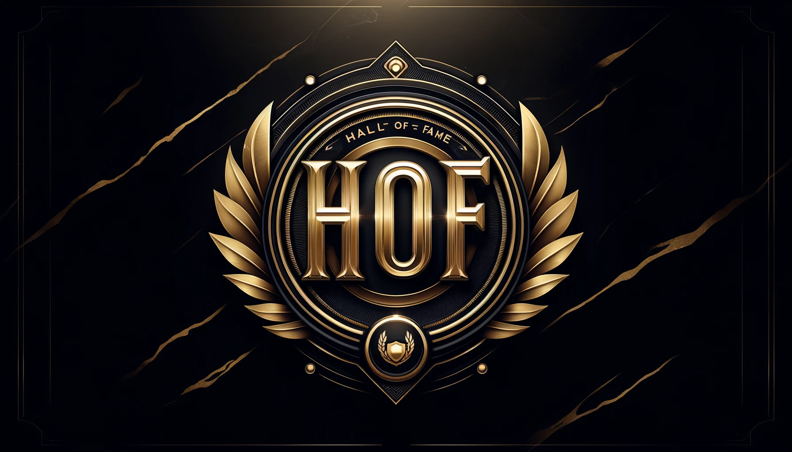

# Discord Hall Of Fame Bot

The purpose of the bot is to monitor the maximum amount of message reactions and repost the message to a board if it surpasses a threshold value. Unlike star bots, this bot is not limited to one emoji but will prompt any emoji reactions.

 

## Configuring

Add the bot to your discord server: https://discord.com/oauth2/authorize?client_id=1177041673352663070

Join the Hall of Fame community server: https://discord.gg/r98WC5GHcn

 

## Commands

| Command                        | Parameters                                                             | Action                                                                                             | Example                                 |
|:-------------------------------|:-----------------------------------------------------------------------|:---------------------------------------------------------------------------------------------------|:----------------------------------------|
| /help                          |                                                                        | List of commands                                                                                   | /help                                   |
| /set_reaction_threshold        | :int                                                                   | Set the amount of reactions needed for a post to reach hall of fame                                | /set_reaction_threshold 5               |
| /include_authors_reaction      | :bool                                                                  | Should the author of a message be included in the reaction count?                                  | /include_authors_reaction               |
| /allow_messages_in_hof_channel | :bool                                                                  | Allow anyone to type in the Hall of Fame channel                                                   | /allow_messages_in_hof_channel          |
| /custom_emoji_check_logic      | All emojis or Only whitelisted emojis                                  | Use only whitelisted emojis for the reaction count                                                 | /custom_emoji_check_logic               |
| /whitelist_emoji               | :emoji                                                                 | Add a whitelisted emoji to the list [custom_emoji_check_logic]                                     | /whitelist_emoji 👍                     |
| /unwhitelist_emoji             | :emoji                                                                 | Remove a whitelisted emoji from the list [custom_emoji_check_logic]                                | /unwhitelist_emoji 👍                   |
| /clear_whitelist               |                                                                        | Clear the whitelist of emojis [custom_emoji_check_logic]                                           | /clear_whitelist                        |
| /get_server_config             |                                                                        | Get the current bot configuration for the server                                                   | /get_server_config                      |
| /calculation_method            | :string ["most_reactions_on_emoji", "total_reactions", "unique_users"] | Change the calculation method for reactions                                                       | /calculation_method                     |
| /hide_hof_post_below_threshold | :bool                                                                  | Should hall of fame posts be hidden when they go below the reaction threshold? (Will be visible again when they reach the threshold again) | /hide_hof_post_below_threshold          |
| /ignore_bot_messages           | :bool                                                                  | Should the bot ignore messages from other bots?                                                                            | /get_server_config                      |
| /user_profile                  | :user                                                                  | Get the Hall of Fame profile for a user                                                                            | /user_profile @HallOfFame               |
| /set_hall_of_fame_channel      | :channel                                                               | Manually set the Hall of Fame channel for the server                                                               | /set_hall_of_fame_channel #hall-of-fame |
| /feedback                      | :forms                                                                 | Got a feature request or bug report? Let us know!                                                  | /feedback                               |
| /vote                          |                                                                        | Support the bot by voting for it on top.gg: https://top.gg/bot/1177041673352663070/vote            | /vote                                   |
| /invite                        |                                                                        | Invite the bot to your server: https://discord.com/oauth2/authorize?client_id=1177041673352663070! | /invite                                 |

 

## Custom Emoji Whitelist
A custom emoji filter can be applied to the bot, so that it will only look for emojis configured to the server.
  - To enable it: ``/custom_emoji_check_logic``
  - Adding emojis to the whitelist: ``/whitelist_emoji``
  - Removing emojis from the whitelist: ``/unwhitelist_emoji`` or ``/clear_whitelist``

 

## Development Log

### 1.16
- [x] </user_profile> command: You can now view both your own and others' Hall of Fame stats.
  - Displays all-time and monthly Hall of Fame post counts.
  - Highlights top users per server – great for competition and recognition.
  - Automatically updated daily via a recurring job.
- [x] Per-server user tracking: The bot now tracks individual user stats (e.g., HOF posts, reaction counts) per server.
- [x] Wide-format calculation method preview: Added to the </help> embed to visually explain the 3 different reaction calculation strategies.
- [x] Improved message metadata: All message entries now store `author_id` and `created_at` for better historical insight and debugging.
- [x] Migration system: Implemented automated data migration to ensure smoother updates and future rollouts.

### 1.15
- [x] /calculation_method command: Added support for custom calculation methods that determine how reaction counts are evaluated. This allows for more flexible and personalized Hall of Fame behavior per server.
- [x] Sticker support in HOF: Messages featuring stickers can now be included in Hall of Fame posts, with proper rendering (not supported for all stickers).
- [x] Improved setup reliability: The bot now handles failed or incomplete setup processes more gracefully, with clearer error messages.

### 1.14
- [x] Refactored all the external command references to be interactive.
- [x] Added command option /ignore_bot_messages for whether to ignore bot messages or not.
- [x] Top.gg API Integration: The bot now supports top.gg API for stats reporting.
- [x] Server Management: Configuration access now extended to ServerManagers, not just ServerOwners.
- [x] Introduced singleton-based variable handling for better maintainability.
- [x] Fixed an issue where it would not post hall of fame messages from users, when they were from the hall of fame channel.
- [x] Leaderboards disabled by default for new servers: It seems to cause confusion for first-time users.
- [x] Concurrency issue fixed on startup routine for loading server classes

### 1.13
- [x] Fixed Intents for Embed Colors
  - Resolved bug causing inconsistent embed colors.
  - Embed colors now dynamically match the top role color.
- [x] Leaderboard 24h Recurring Job
  - Leaderboard now updates automatically every 24 hours.
- [x] HOF Wrapped Tweaks
  - Minor improvements to the Hall of Fame Wrapped (December event).

### 1.12
- [x] ``/get_server_config`` for viewing the current server settings for the bot
- [x] Added custom emoji whitelist logic for the reaction threshold
  - To enable it: ``/custom_emoji_check_logic``
  - Adding emojis to the whitelist: ``/whitelist_emoji``
  - Removing emojis from the whitelist: ``/unwhitelist_emoji`` or ``/clear_whitelist``

### 1.11
- [x] Approved for top.gg - vote here for the bot: https://top.gg/bot/1177041673352663070
- [x] Slash Commands!
- [x] Refactored code-base for cloud deployment and for handling multiple servers

### 1.10
- [x] Threshold increase and general adjustments

### 1.09
- [x] Hall Of Fame Wrapped

### 1.08
- [x] Better context vísualization of replied messages
- [x] Added user's role color to embed color

### 1.07
- [x] Solved async simultaneous reacting on posts

### 1.06
- [x] LLM outlier detection of voting-based messages, which should not be classified as a Hall Of Fame message. 

### 1.05
- [x] Hall-of-fame posts which are replies to previous messages will include the context.

### 1.04
- [x] Only count non-author reactions towards the total amount for threshold
- [x] When a post goes below the threshold remove the embed, but keep the message so that it would be able to be reposted again

### 1.03
- [x] When the reaction counter goes up on an existing hall-of-fame post, it should update the message with the total amount of reactions
- [x] Remove incoming non-bot posts in the hall-of-fame channel

### 1.02
- [x] New gifs should be added to the user/server database as they get posted, instead of having to use the fetch command
- [x] Servers most used gifs
- [x] Users most used gifs

### 1.01
- [x] Problem with using discord user profile pictures using Discord<=2.0.0
- [x] Deploy on a remote server
- [x] Improve the embed layout of messages
- [x] Improve media output
- [x] Improve database structure to mongodb
- [x] Functionality for checking historical messages (it should run through all the messages and post the ones above the reaction value threshold
- [x] When posting the message highlight the reaction emoji from the original message
- [x] Fix message IDs not being saved/loaded correctly when validating if it has already been sent
- [x] Create a getRandom() function for grabbing a random hall-of-fame post
